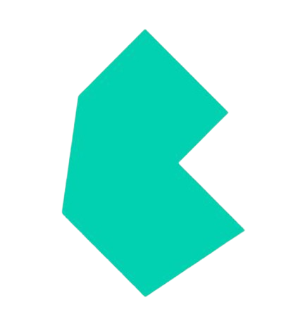
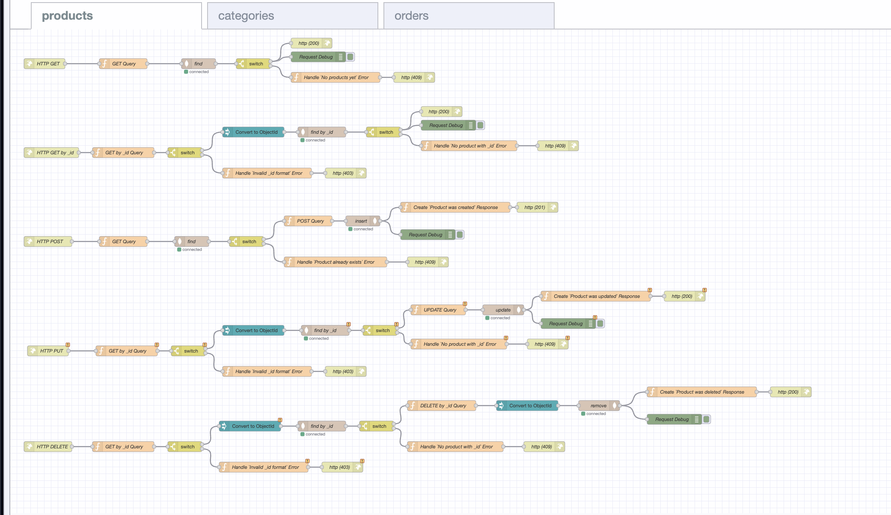
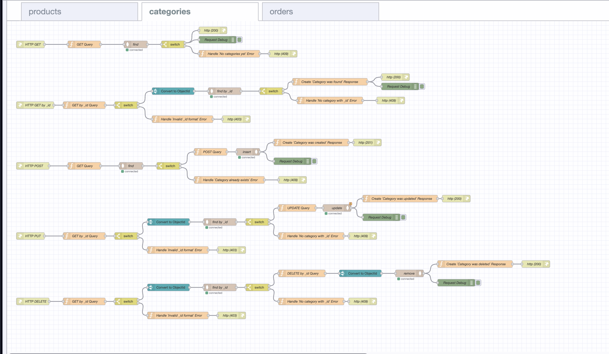
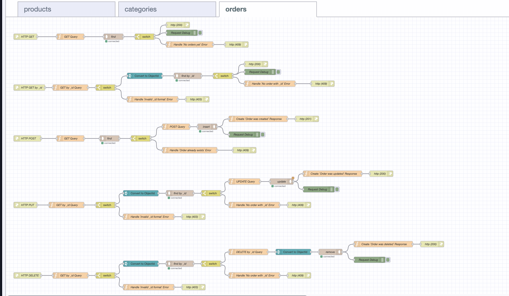

<h1 align="center">Inventory Management System </h1>

## Project Overview:

The **Inventory Management System** project aims to develop a comprehensive solution for managing inventory, including products, categories, and orders. It utilizes React for the front-end, MongoDB for the database, and Node-RED for the back-end API. This system enables efficient management of inventory items and orders, enhancing operational efficiency.

## [DEMO LINK](https://ViktorBykh.github.io/inventory-flow)

### Login Credentials:

##### Admin Login:

- **Email:** `admin@deepersignals.com`
- **Password:** `password`

##### User Login:

- **Email:** `user@deepersignals.com`
- **Password:** `password`

**Note**: Regular users cannot access the category management features.

####  Features:

1. **Product Management:**
   Enables display, addition, editing, and removal of products with details such as name, category, price, and quantity.

2. **Category Management:**
   Allows for the display, addition, editing, and removal of product categories.

3. **Order Management:**
   Facilitates the display, creation, update, and removal of orders with details like order number, customer name, order date, and total cost.

4. **Order Placement:**
   Enables users to place orders by selecting products and specifying quantities.

5. **Data Aggregation:**
   Implements MongoDB aggregation queries to provide insightful data analytics.

## Frontend UI:

-  React
-  Bulma
-  Web Token
-  TypeScript
-  JavaScript
-  HTML
-  Sass
-  Jest
-  GithHub Pages

## Backend API:

-  Node-RED
-  FlowFuse
-  JavaScript
-  MongoDB
-  MongoDB Cluster

##### Description:

1. The Frontend UI is developed using the React framework, offering a dynamic and responsive user interface.
2. Implements a comprehensive system for managing inventory, including products, categories, and orders.
3. The frontend is developed with JavaScript, React, HTML, and CSS.

## Frontend UI Endpoints 

1. ### Products

- **Endpoint:** `/products`
- **Method:** GET, POST, PUT, DELETE
- **Description:** Manage products including display, addition, editing, and removal.

2. ### Categories

- **Endpoint:** `/categories`
- **Method:** GET, POST, PUT, DELETE
- **Description:** Manage categories including display, addition, editing, and removal.

3. ### Orders

- **Endpoint:** `/orders`
- **Method:** GET, POST, PUT, DELETE
- **Description:** Manage orders including display, addition, editing, and removal.
  The project is organized into several directories, each serving a specific purpose. Below is an overview of the main directories and files in the project:

### `src` Directory

This is the root directory for the front-end codebase.

#### `api` Directory

Contains the API endpoint files which interact with the backend services.

- **`categories.ts`**: Handles API requests related to product categories.
- **`orders.ts`**: Manages API requests for orders.
- **`products.ts`**: Deals with API requests for products.

#### `auth` Directory

Contains authentication-related files.

- **`auth.ts`**: Manages user authentication functions.

#### `components` Directory

Houses the React components organized by functionality.

- **`Category` Directory**: Components related to product categories.

  - **`CategoryAdd.tsx`**: Form for adding a new category.
  - **`CategoryEdit.tsx`**: Form for editing an existing category.
  - **`CategoryItem.tsx`**: Displays a single category.
  - **`CategoryList.tsx`**: Lists all categories.
  - **`CategoryLoader.tsx`**: Loading spinner for categories.

- **`Order` Directory**: Components related to orders.

  - **`OrderAdd.tsx`**: Form for adding a new order.
  - **`OrderEdit.tsx`**: Form for editing an existing order.
  - **`OrderItem.tsx`**: Displays a single order.
  - **`OrderList.tsx`**: Lists all orders.
  - **`OrderLoader.tsx`**: Loading spinner for orders.

- **`Product` Directory**: Components related to products.

  - **`ProductAdd.tsx`**: Form for adding a new product.
  - **`ProductEdit.tsx`**: Form for editing an existing product.
  - **`ProductItem.tsx`**: Displays a single product.
  - **`ProductList.tsx`**: Lists all products.
  - **`ProductLoader.tsx`**: Loading spinner for products.

- **`LoginForm.tsx`**: Component for the login form.
- **`Navigation.tsx`**: Component for the navigation bar.

#### `enums` Directory

Defines enumerations used throughout the application.

- **`backgroundColor.ts`**: Enum for background colors.
- **`categoryImages.ts`**: Enum for category images.
- **`productImages.ts`**: Enum for product images.

#### `types` Directory

Contains TypeScript type definitions.

- **`Category.ts`**: Type definitions for categories.
- **`Order.ts`**: Type definitions for orders.
- **`Product.ts`**: Type definitions for products.

#### `utils` Directory

Houses utility functions used across the application.

- **`fetchClient.ts`**: Utility for making API requests.
- **`getColor.ts`**: Utility for getting colors.
- **`getImage.ts`**: Utility for getting images.
- **`wait.ts`**: Utility for introducing delays.

#### Root Files

- **`App.tsx`**: Main application component.
- **`index.tsx`**: Entry point for the React application.

## Backend API Endpoints 

### Products



#### 1. Get All Products

- **Endpoint:** `/products`
- **Method:** GET
- **Description:** Retrieves a list of all products.
- **Responses:**
  - 200 OK: Returns the list of products.
  - 403 Forbidden: If there is an access restriction.

#### 2. Get Product by ID

- **Endpoint:** `/products/:productId`
- **Method:** GET
- **Description:** Retrieves details of a specific product by its ID.
- **Parameters:**
  - `productId`: The ID of the product to retrieve.
- **Responses:**
  - 200 OK: Returns the product details.
  - 409 Conflict: If no product is found with the given ID.

#### 3. Create a New Product

- **Endpoint:** `/products`
- **Method:** POST
- **Description:** Creates a new product with the provided details.
- **Request Body:**
  - `name`: The name of the product.
  - `category`: The category of the product.
  - `price`: The price of the product.
  - `quantity`: The quantity of the product.
- **Responses:**
  - 201 Created: If the product is successfully created.

#### 4. Update a Product

- **Endpoint:** `/products/:productId`
- **Method:** PUT
- **Description:** Updates an existing product with the provided details.
- **Parameters:**
  - `productId`: The ID of the product to update.
- **Request Body:**
  - `name` (optional): The updated name of the product.
  - `category` (optional): The updated category of the product.
  - `price` (optional): The updated price of the product.
  - `quantity` (optional): The updated quantity of the product.
- **Responses:**
  - 200 OK: If the product is successfully updated.
  - 409 Conflict: If no product is found with the given ID.

#### 5. Delete a Product

- **Endpoint:** `/products/:productId`
- **Method:** DELETE
- **Description:** Deletes a specific product by its ID.
- **Parameters:**
  - `productId`: The ID of the product to delete.
- **Responses:**
  - 200 OK: If the product is successfully deleted, returns a message indicating deletion.
  - 409 Conflict: If no product is found with the given ID.

### Categories



#### 1. Get All Categories

- **Endpoint:** `/categories`
- **Method:** GET
- **Description:** Retrieves a list of all categories.
- **Responses:**
  - 200 OK: Returns the list of categories.
  - 403 Forbidden: If there are no categories yet.

#### 2. Create a New Category

- **Endpoint:** `/categories`
- **Method:** POST
- **Description:** Creates a new category with the provided details.
- **Request Body:**
  - `name`: The name of the category.
  - `description`: A description of the category.
- **Responses:**
  - 201 Created: If the category is successfully created.

#### 3. Update a Category

- **Endpoint:** `/categories/:categoryId`
- **Method:** PUT
- **Description:** Updates an existing category with the provided details.
- **Parameters:**
  - `categoryId`: The ID of the category to update.
- **Request Body:**
  - `name` (optional): The updated name of the category.
  - `description` (optional): The updated description of the category.
- **Responses:**
  - 200 OK: If the category is successfully updated.
  - 409 Conflict: If no category is found with the given ID.

#### 4. Delete a Category

- **Endpoint:** `/categories/:categoryId`
- **Method:** DELETE
- **Description:** Deletes a specific category by its ID.
- **Parameters:**
  - `categoryId`: The ID of the category to delete.
- **Responses:**
  - 200 OK: If the category is successfully deleted, returns a message indicating deletion.
  - 409 Conflict: If no category is found with the given ID.

### Orders



#### 1. Get All Orders

- **Endpoint:** `/orders`
- **Method:** GET
- **Description:** Retrieves a list of all orders.
- **Responses:**
  - 200 OK: Returns the list of orders.

#### 2. Create a New Order

- **Endpoint:** `/orders`
- **Method:** POST
- **Description:** Creates a new order with the provided details.
- **Request Body:**
  - `productId`: The ID of the product to order.
  - `quantity`: The quantity of the product to order.
  - `customerName`: The name of the customer placing the order.
- **Responses:**
  - 201 Created: If the order is successfully created.

#### 3. Update an Order

- **Endpoint:** `/orders/:orderId`
- **Method:** PUT
- **Description:** Updates an existing order with the provided details.
- **Parameters:**
  - `orderId`: The ID of the order to update.
- **Request Body:**
  - `productId` (optional): The updated product ID of the order.
  - `quantity` (optional): The updated quantity of the product.
  - `customerName` (optional): The updated customer name of the order.
- **Responses:**
  - 200 OK: If the order is successfully updated.
  - 409 Conflict: If no order is found with the given ID.

#### 4. Delete an Order

- **Endpoint:** `/orders/:orderId`
- **Method:** DELETE
- **Description:** Deletes a specific order by its ID.
- **Parameters:**
  - `orderId`: The ID of the order to delete.
- **Responses:**
  - 200 OK: If the order is successfully deleted, returns a message indicating deletion.
  - 409 Conflict: If no order is found with the given ID.

## Testing 

The project includes tests for the API, components, and utility functions. The tests are written using Jest and React Testing Library.

### API Tests

These tests ensure the backend API endpoints function correctly.

- `tests/api/categories.test.ts`
- `tests/api/orders.test.ts`
- `tests/api/products.test.ts`

### Component Tests

These tests ensure the React components behave as expected.

#### Category Component Tests

- `tests/components/Category/CategoryAdd.test.tsx`
- `tests/components/Category/CategoryEdit.test.tsx`
- `tests/components/Category/CategoryItem.test.tsx`
- `tests/components/Category/CategoryList.test.tsx`
- `tests/components/Category/CategoryLoader.test.tsx`

#### Order Component Tests

- `tests/components/Order/OrderAdd.test.tsx`
- `tests/components/Order/OrderEdit.test.tsx`
- `tests/components/Order/OrderItem.test.tsx`
- `tests/components/Order/OrderList.test.tsx`
- `tests/components/Order/OrderLoader.test.tsx`

#### Product Component Tests

- `tests/components/Product/ProductAdd.test.tsx`
- `tests/components/Product/ProductEdit.test.tsx`
- `tests/components/Product/ProductItem.test.tsx`
- `tests/components/Product/ProductList.test.tsx`
- `tests/components/Product/ProductLoader.test.tsx`

### Utility Function Tests

These tests ensure utility functions work correctly.

- `tests/utils/fetchClient.test.ts`
- `tests/utils/getColor.test.ts`
- `tests/utils/getImage.test.ts`

### Running Tests

To run the tests, use the following command:

```
npm test
```

Sample output:

```
bash$ npm test

 inventory-flow@0.1.0 test
 jest

 PASS  tests/api/categories.test.ts
 PASS  tests/api/orders.test.ts
 PASS  tests/utils/fetchClient.test.ts
 PASS  tests/api/products.test.ts
 PASS  tests/components/Order/OrderAdd.test.tsx
 PASS  tests/components/Product/ProductEdit.test.tsx
 PASS  tests/components/Product/ProductList.test.tsx
 PASS  tests/components/Order/OrderLoader.test.tsx
 PASS  tests/components/Category/CategoryList.test.tsx
 PASS  tests/components/Order/OrderEdit.test.tsx
 PASS  tests/components/Order/OrderItem.test.tsx
 PASS  tests/components/Category/CategoryEdit.test.tsx
 PASS  tests/components/Category/CategoryItem.test.tsx
 PASS  tests/components/Product/ProductLoader.test.tsx
 PASS  tests/components/Product/ProductAdd.test.tsx
 PASS  tests/utils/getImage.test.ts
 PASS  tests/components/Product/ProductItem.test.tsx
 PASS  tests/components/Category/CategoryLoader.test.tsx
 PASS  tests/utils/getColor.test.ts
 PASS  tests/components/Order/OrderList.test.tsx
 PASS  tests/components/Category/CategoryAdd.test.tsx

Test Suites: 21 passed, 21 total
Tests:       83 passed, 83 total
Snapshots:   0 total
Time:        4.472 s, estimated 5 s
Ran all test suites.
```
